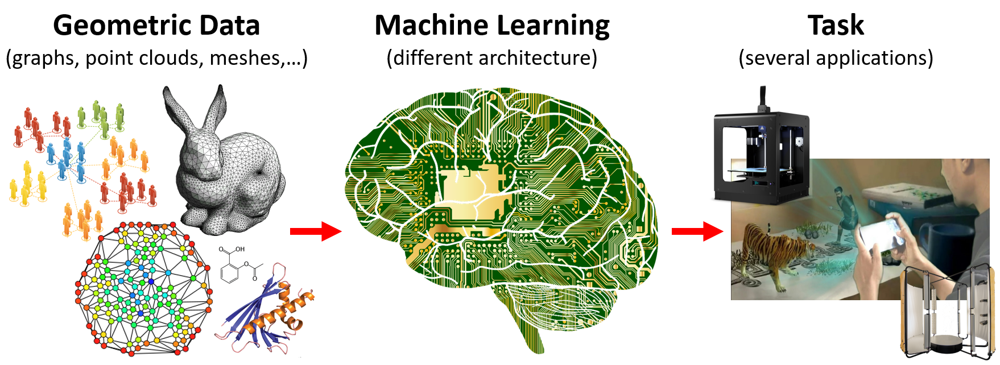

# GeoProML4GeoData

This is the Repository for the course Geometry Processing and Machine Learning for Geometric Data, yields at the University of Milano - Bicocca, in November 2023.

**Lecturers:** Simone Melzi [website](https://sites.google.com/site/melzismn/), Riccardo Marin [website](https://ricma.netlify.app/)

**Where:**
Aula Seminari, First floor, Building U14, Viale Sarca 336, 20125, Milan (Italy)
Department of Informatics, Systems and Communication (DISCo)
University of Milan-Bicocca

**When:** 

      Thursday 23/11/2023    8.30 - 12.30 and 14.00 - 18.00

      Friday  24/11/2023    8.30 - 12.30 and 14.00 - 18.00
      
      Monday  27/11/2023    8.30 - 12.30 and 14.00 - 18.00
      
       
**Programme and resources:** 

**Date** | **Slot** | **Topic** | **Code & Data** | **slides**
------------ | ------------- | ------------ | ------------ | -------------
| | |
Thu 23 Nov | 8.30 - 10.30 | Introduction to 3D data |  | [SLIDES1](https://drive.google.com/file/d/1Z_9NyLO6gQsrBY-HlCPEfqKZU1eE-ix1/view?usp=sharing) |
| | |
Thu 23 Nov | 10.30 - 12.30 | LAB0 + 3D Applications | [LAB0](https://colab.research.google.com/drive/15MepjZaC3mMlNkgtslq67FvMP2zIFTpV?usp=sharing) | [SLIDES2](https://drive.google.com/file/d/132X0cCtKgIltpj1iWwlzSRCsSIz9LUlB/view?usp=sharing) |
| | |
Thu 23 Nov | 14.00 - 16.00 | Spectral representation |  |  |
| | |
Thu 23 Nov | 16.00 - 18.00 | LAB1 - Applications |  |  |
| | |
Fri 24 Nov | 8.30 - 10.30 | Point-based architectures  |  |  |
| | |
Fri 24 Nov | 10.30 - 12.30 | LAB2 - Point-based |  |  |
| | |
Fri 24 Nov | 14.00 - 16.00 | Implicit and Volumetric |  |  |
| | |
Fri 24 Nov | 16.00 - 18.00 | LAB3 - Implicit and Volumetric |  |  |
| | |
Mon 27 Nov | 8.30 - 10.30 | ML on Graphs |  |  |
| | |
Mon 27 Nov | 10.30 - 12.30 | LAB4 - ML on Graphs |  |  |
| | |
Mon 27 Nov | 14.00 - 16.00 | Mesh Convolution + LAB5 |  |  |
| | |
Mon 27 Nov | 16.00 - 18.00 | Future direction and discussion |  |  |
| | |
